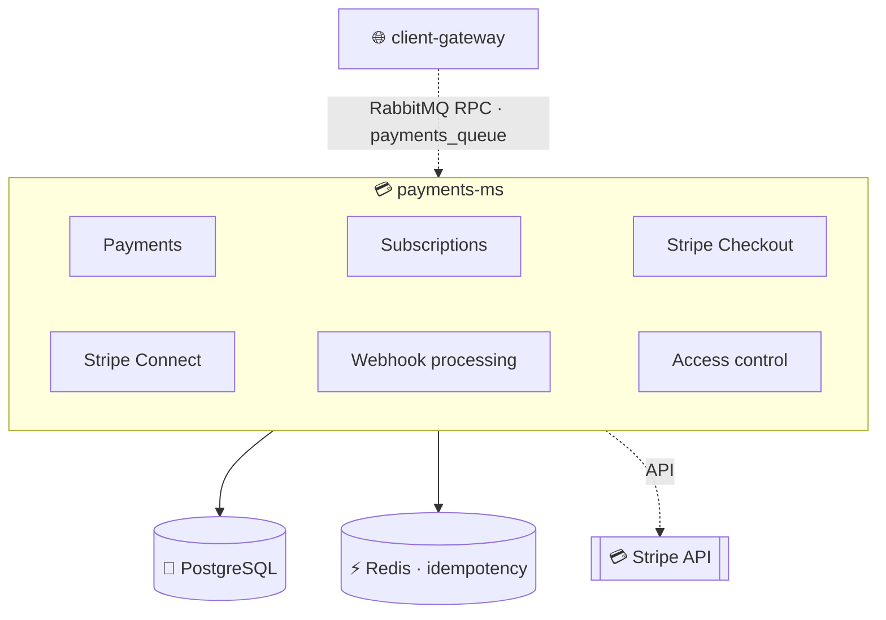
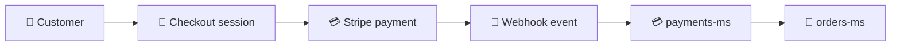

<h1 align="center">💳 Payments Microservice · <code>payments-ms</code></h1>

<p align="center">
  <b>NestJS microservice</b> handling payments, subscriptions, Stripe Connect accounts and access control<br/>
  in a multi-tenant environment. <i>The central payment platform for the entire ecosystem.</i>
</p>

<p align="center">
  
  
  
  
  
</p>

<p align="center">
  
  
  
  
</p>

<br/>

## 🚀 Overview

`payments-ms` manages customer payments, the subscription lifecycle, Stripe Checkout Sessions, Stripe Connect Express accounts, payment methods, access validation, webhook processing and payment analytics/reporting.

> [!IMPORTANT]
> Designed as a **pure RabbitMQ microservice** — it does **not** expose any public REST API. It integrates with Stripe for payment processing, subscription billing and marketplace onboarding.

<br/>

## 🏗️ Architecture



<br/>

## ✨ Features

Stripe Checkout integration · subscription management · Stripe Connect Express onboarding · payment tracking · POS payment methods · access validation · event-driven communication · Redis idempotency protection · multi-tenant support · cash-session reporting · payment analytics.

<br/>

## 🛠️ Tech Stack

| Category | Technology |
|---|---|
| Framework | NestJS 11 |
| Language | TypeScript 5 |
| Database | PostgreSQL |
| ORM | TypeORM 0.3 |
| Messaging | RabbitMQ |
| Cache | Redis |
| Payments | Stripe |
| Validation | class-validator |
| Environment validation | Zod |
| Testing | Jest |

<br/>

## ⚙️ Getting Started

**Prerequisites:** Node.js 20+, PostgreSQL, RabbitMQ, Redis, a Stripe account.

```bash
npm install
cp .env.example .env
npm run start:dev
```

<details>
<summary><b>📜 Available scripts</b></summary>

<br/>

```bash
npm run build
npm run start        # start / start:dev / start:debug / start:prod
npm run lint
npm run format
npm run test         # test / test:watch / test:cov
```

</details>

<br/>

## 🌍 Environment Variables

| Variable | Required | Description |
|---|:---:|---|
| `NODE_ENV` | ✅ | Environment |
| `PORT` | ❌ | Service port |
| `DB_HOST` | ✅ | PostgreSQL host |
| `DB_PORT` | ❌ | PostgreSQL port |
| `POSTGRES_USER` | ✅ | Database user |
| `POSTGRES_PASSWORD` | ✅ | Database password |
| `POSTGRES_DB` | ✅ | Database name |
| `RABBITMQ_URL` | ✅ | RabbitMQ connection string |
| `RABBITMQ_QUEUE` | ✅ | RPC queue |
| `RABBITMQ_QUEUE_EVENTS_PAYMENTS` | ✅ | Events queue |
| `RABBITMQ_QUEUE_EVENTS_ORDERS` | ✅ | Orders queue |
| `RABBITMQ_QUEUE_EVENTS_ORGANIZATION` | ✅ | Organization queue |
| `CLIENT_URL` | ✅ | Frontend URL |
| `STRIPE_SECRET` | ✅ | Stripe API key |
| `STRIPE_PRICE_ID_BASIC` | ✅ | Basic plan price ID |
| `STRIPE_PRICE_ID_PRO` | ✅ | Pro plan price ID |
| `REDIS_HOST` | ✅ | Redis host |
| `REDIS_PORT` | ❌ | Redis port |
| `REDIS_PASS` | ✅ | Redis password |

<br/>

## 📨 RabbitMQ Patterns

<details>
<summary><b>💳 Payments patterns</b></summary>

<br/>

| Pattern | Description |
|---|---|
| `payment.session.create.payment` | Create checkout session |
| `payment.create.payment` | Create payment |
| `payment.find_all` | List payments |
| `payment.find_my` | User payments |
| `payment.get_by_id` | Get payment |
| `payment.update` | Update payment |
| `payment.cancel` | Cancel payment |
| `payment.totals_by_method` | Totals by method |
| `payment.totals_by_method_range` | Totals by date range |

</details>

<details>
<summary><b>🔁 Subscriptions patterns</b></summary>

<br/>

| Pattern | Description |
|---|---|
| `subscription.session.create.onboarding` | Start onboarding |
| `subscription.get_plans` | Available plans |
| `subscription.get_by_user` | User subscription |
| `subscription.get_my_history` | Billing history |
| `subscription.change_plan` | Change plan |
| `subscription.cancel` | Cancel subscription |
| `subscription.resume` | Resume subscription |

</details>

<details>
<summary><b>🏷️ Payment Methods patterns</b></summary>

<br/>

| Pattern | Description |
|---|---|
| `payment-method.create` | Create method |
| `payment-method.findAll` | List methods |
| `payment-method.findOne` | Get method |
| `payment-method.update` | Update method |
| `payment-method.softDelete` | Soft delete |
| `payment-method.restore` | Restore |

</details>

<details>
<summary><b>🔓 Access Control · Stripe Connect · Webhooks patterns</b></summary>

<br/>

| Pattern | Description |
|---|---|
| `access.check` | Subscription status |
| `access.check_onboarding` | Onboarding validation |
| `stripe.connect.account` | Create or recover Express account |
| `payment.webhook` | Process Stripe events |

</details>

<br/>

## 💰 Stripe Integration

**Supported features:** Checkout Sessions (one-time + subscription payments) · subscriptions (upgrade/downgrade/cancel/resume, invoice history) · Stripe Connect (Express accounts, onboarding links, account recovery, marketplace payments).



<details>
<summary><b>📡 Supported webhook events</b></summary>

<br/>

`checkout.session.completed` · `checkout.session.expired` · `invoice.paid` · `invoice.payment_failed` · `customer.subscription.updated` · `customer.subscription.deleted` · `payment_intent.succeeded` · `payment_intent.payment_failed` · `payment_intent.canceled` · `account.updated` · `account.application.deauthorized`

</details>

<details>
<summary><b>🔒 Idempotency</b></summary>

<br/>

Webhook events are protected using Redis locks, with a **72-hour TTL**:

```text
stripe:evt:lock:<eventId>
stripe:evt:done:<eventId>
```

</details>

<br/>

## 🗄️ Database Entities

<details>
<summary><b>View all entities</b></summary>

<br/>

| Entity | Purpose | Main fields |
|---|---|---|
| **Payment** | A customer payment | `organizationId`, `orderId`, `subscriptionId`, `amount`, `currency`, `status`, `provider`, `externalPaymentId`, `externalSessionId`, `paidAt`, `cancelledAt` |
| **Subscription** | A customer subscription (plans: `BASIC`, `PRO`) | `userId`, `plan`, `status`, `stripeSubscriptionId`, `currentPeriodStart`, `currentPeriodEnd`, `cancelAtPeriodEnd`, `priceAmount` |
| **PaymentMethod** | A POS payment method (Cash, Card, Voucher, Gift Card…) | `organizationId`, `name`, `icon`, `isCash`, `isDefault`, `isSystem`, `isActive` |

</details>

<br/>

## 🔗 External Dependencies

| Dependency | Usage |
|---|---|
| 🐘 **PostgreSQL** | Stores payments, subscriptions, payment methods |
| 🐇 **RabbitMQ** | RPC + event-driven communication with orders-ms, organization-ms, auth-ms, client-gateway |
| ⚡ **Redis** | Webhook idempotency + cache invalidation |
| 💳 **Stripe** | Checkout Sessions, subscriptions, invoices, Stripe Connect |

<br/>

## ⚠️ Development Notes / Limitations

> [!WARNING]
> Tracked openly and worth verifying before production.

- **Refunds:** not implemented yet — the service marks payments as cancelled but does **not** call `stripe.refunds.create()`.
- **PayPal:** not implemented — only Stripe is currently supported.
- **Webhook gateway:** Stripe signature verification is performed **outside** this service; webhook events are received through RabbitMQ after validation by another service.

<br/>

## 📈 Service Scope

`payments-ms` handles both sides of the platform:

- **SaaS billing** — subscription plans, customer onboarding, access control.
- **POS payments** — order payments, payment methods, cash reporting, payment analytics.

This makes it the central payment platform for the entire ecosystem.

<p align="center">
  
</p>